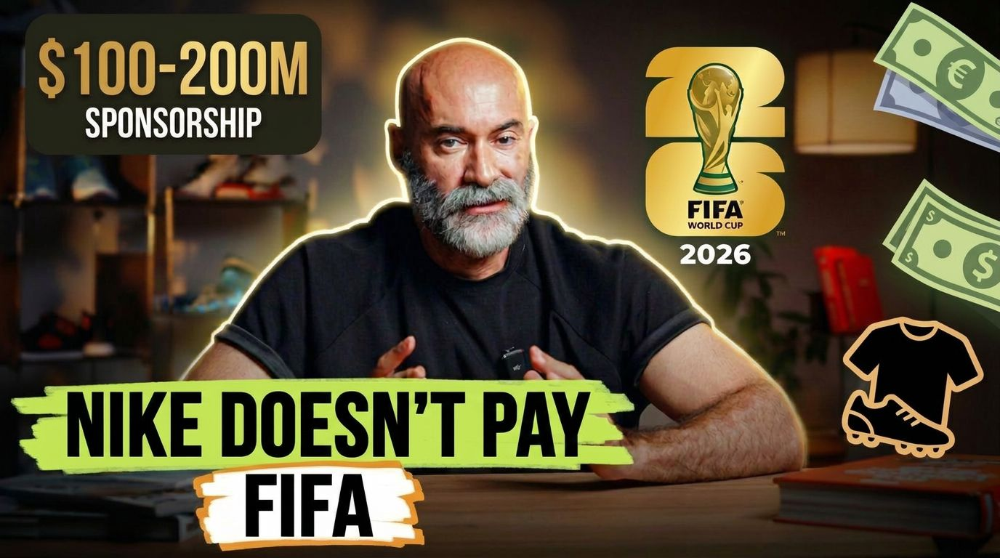

# LA — Cheap Video Thumbnails

**AI thumbnail generator — ~$0.06 per image, under a minute, no design skills required.**

A Claude skill that turns one raw video screenshot into a professional, high-CTR YouTube thumbnail.

Built on **Google Nano Banana 2** (`google/nano-banana-2` on Replicate). Give it a screenshot and your video's title/script, answer 2-3 quick questions, and get back a fully composited thumbnail: cropped subject, glow outline, color grade, bold headline, and topic-relevant graphics — not just text pasted on a screenshot.

## Why this exists

Most "AI thumbnail" prompts just overlay text on your unedited screenshot — flat, cluttered, doesn't look designed. This skill encodes everything learned from iterating that failure out: which model to use, how to phrase prompts so the background actually gets reworked, how to balance composition, and — critically — how to make *revisions* without the model re-inventing the whole image and introducing new mistakes (duplicated elements, drifted faces, etc.).

## What you get

- **Hook extraction** — feed it your video title or full script, it pulls 3-4 punchy 2-4 word hook phrases for the headline, you pick or write your own
- **Quick or full questionnaire** — 3 questions by default (tone, text style, thematic graphics), or opt into full control (crop, glow, background treatment, color palette, data badges, channel logo, aspect ratio, reference thumbnail to copy techniques from)
- **Composition rules baked in** — no empty half-frame, no duplicated icons/numbers, thick readable fonts, always checked before sending to the model
- **Real revision handling** — edits are done as diffs against your last *accepted* version, never a full regeneration from scratch, so approved details don't drift
- **Format support** — standard 16:9 YouTube thumbnails or 9:16 for Shorts/Reels/TikTok
- **Self-improving** — every rejected version gets logged with why it failed, so future defaults for your channel get better over time

## Before/after example

**Before** — raw, unedited video screenshot:


**After** — generated by this skill:



From that raw mid-sentence talking-head screenshot + the line *"Nike doesn't pay FIFA but outfits more teams than Adidas"* from a video script, this skill produced the thumbnail above: tight crop + glow outline on the subject, blurred/darkened background, bold marker-highlight headline "NIKE DOESN'T PAY FIFA", a FIFA World Cup 2026 emblem + money graphics balancing the empty side of the frame, and a data badge ("$100-200M SPONSORSHIP") pulled straight from the script. Full before/after and iteration history in [`reference/lessons_learned.md`](reference/lessons_learned.md).

## Setup

### 1. Replicate account + API token
1. Create a free account at [replicate.com](https://replicate.com).
2. Add a payment method (Account → Billing). Nano Banana 2 is pay-per-generation — a few cents per image, no subscription.
3. Generate a token at [replicate.com/account/api-tokens](https://replicate.com/account/api-tokens) (starts with `r8_...`).
4. **Never paste the token into a chat with Claude.** Store it as an environment variable instead:
   ```bash
   echo 'export REPLICATE_API_TOKEN="r8_your_token_here"' >> ~/.zshrc
   source ~/.zshrc
   ```
5. If a token is ever accidentally exposed (pasted in chat, committed to a repo, etc.), revoke it immediately at the link above and generate a new one.

Verify it works:
```bash
curl -s -H "Authorization: Token $REPLICATE_API_TOKEN" https://api.replicate.com/v1/account
```
A successful call returns your Replicate username as JSON.

### 2. Desktop Commander (or equivalent local-shell MCP)
Replicate's API needs to be called from a shell with real internet access. If you're running Claude in a sandboxed environment (like Claude Cowork's default sandbox), its network proxy blocks `api.replicate.com` — you need an MCP that runs commands on your actual machine (e.g. Desktop Commander). This is a separate MCP connection, not bundled in this skill.

### 3. Install the skill
Drop the `nano-banana-thumbnail/` folder (or the packaged `.skill` file) wherever your Claude setup loads skills from. See `SKILL.md` for the full workflow spec — that's the file Claude actually reads to run this.

## Usage

Just tell Claude something like:
> "Here's a screenshot from my video, and here's the title/script — make me a thumbnail"

Claude will:
1. Ask for the screenshot + title/script if not already provided
2. Suggest hook-phrase options from your script
3. Ask its quick 3-question style check (or offer full mode)
4. Show you the assembled prompt before generating
5. Generate via Replicate, save the result, and show it to you
6. On revision requests, edit the *previous accepted file* with a targeted diff instead of starting over

## Repo structure

```
nano-banana-thumbnail/
├── SKILL.md                       # the actual skill definition Claude reads
├── README.md                      # this file
├── source_screenshot.png          # raw "before" screenshot shown above
├── example_thumbnail.jpeg         # generated "after" thumbnail shown above
├── scripts/
│   └── generate_thumbnail.py      # Replicate API call + versioned file output
└── reference/
    ├── prompt_template.md         # base prompt structures (first gen + revisions)
    └── lessons_learned.md         # running log of what failed and why — grows over time
```

## Cost

Nano Banana 2 pricing is pay-per-image on Replicate (check current pricing on the [model page](https://replicate.com/google/nano-banana-2) — it changes). Measured from actual Replicate billing across real runs: **roughly $0.06–0.09 per generated image**. A typical finished thumbnail takes 2-4 generations (1 first draft + 1-3 revisions) to land, so a polished, ready-to-publish thumbnail costs somewhere around $0.15–0.35 total — well under what a freelance designer or a Photoshop/Canva subscription would run per thumbnail.

## Known limitations

- Text rendering can occasionally distort on longer headlines — keep hook phrases to 2-4 words
- The model is conservative about background edits unless explicitly told to blur/darken/recompose — this skill's prompt template already accounts for that, but heavily customized prompts can reintroduce the issue
- Revisions must reference the previous *file*, not just describe the change in words — this skill's workflow handles that automatically, but if you're prompting Replicate manually outside this skill, remember to pass the last accepted image as `image_input`

## License

No license — all rights reserved. This is a personal workflow tool; feel free to read and learn from it, but it's not licensed for reuse/redistribution.
